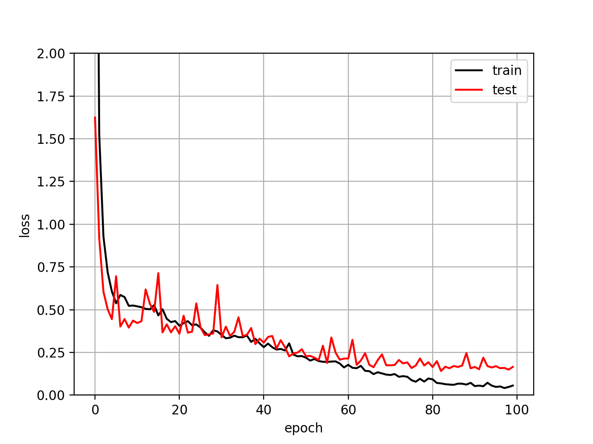
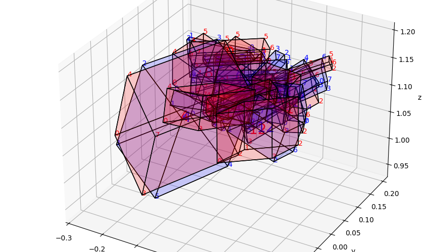
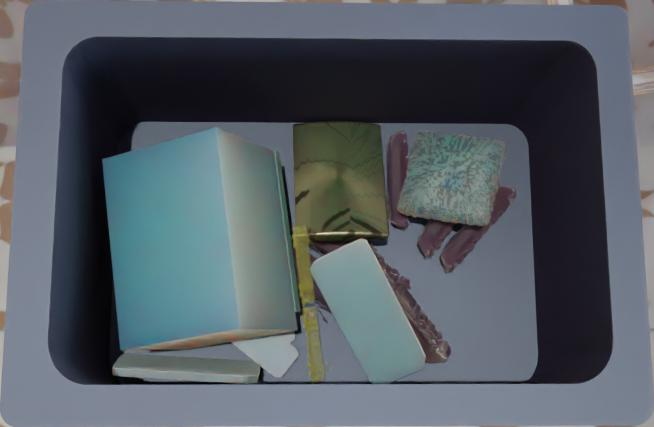
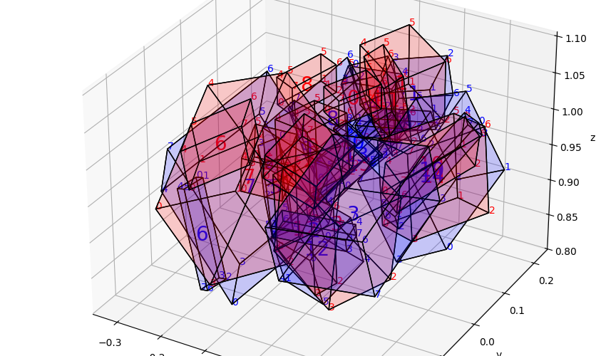
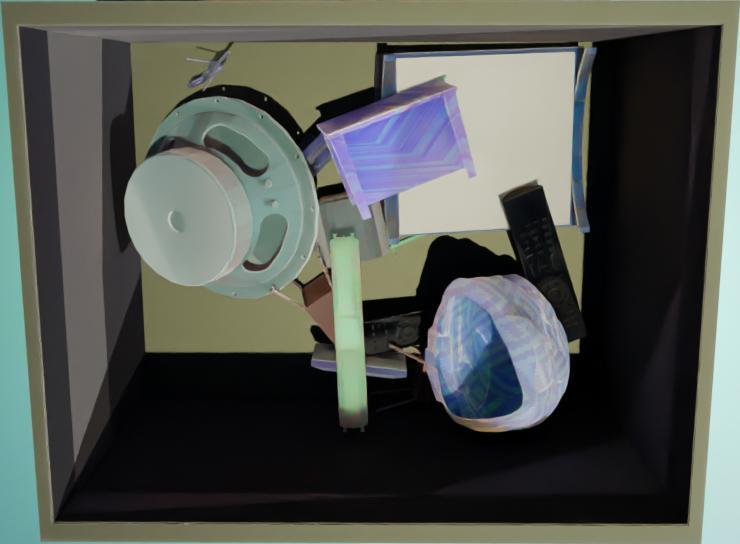
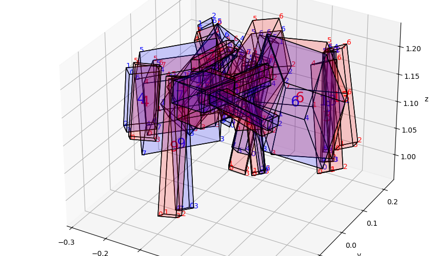
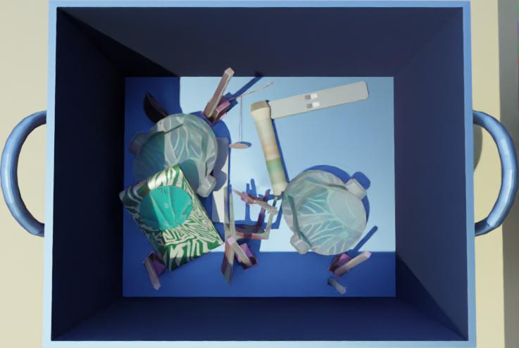
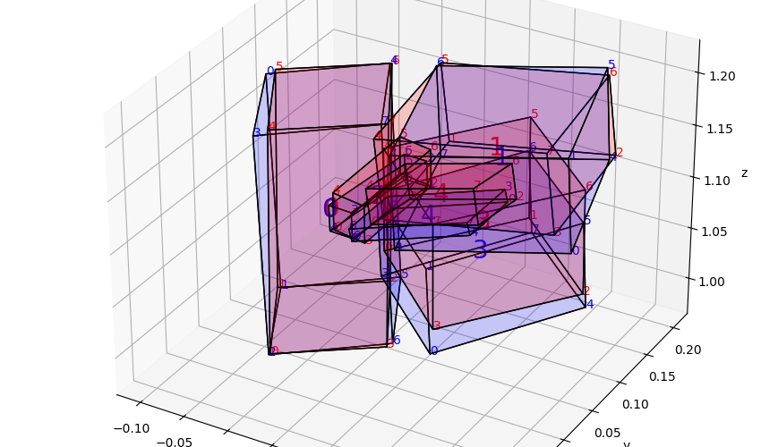
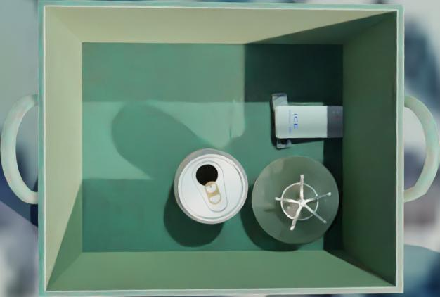

# 3D Bounding Boxes

2026-04-15 by David Nicklaser  

The project inferences 3D bounding boxes from a 3D point cloud and an image segmentation mask.

## Setup

Move into the project directory:
```bash
cd 3d-bboxes
```

Make sure you have *Python 3.12* installed and activated. You can check with:
```bash
python3 --version
```

Create a virtual environment, activate it and install the requirements:
```bash
python3 -m venv .venv && source .venv/bin/activate
pip install -r requirements.txt
```

To begin training, run *train.py*. Ensure that the *./dl_challenge_train* directory contains the necessary data samples, as they are not provided here.
```bash
python3 train.py
```

Run the *inference.py* file to perform inference and visualization. Ensure that the *./dl_challenge_train* directory contains data samples. Four sample files are provided, and they were not used during model training.
```bash
python3 inference.py
```

To adjust parameters, modify the *constants.py* file.


## Code Structure


## Methodology

### Data Loader [`utils/dataset_dl_challenge.py`]

When inspecting the data, I found that the order of bounding boxes in one file matches the order of masks in another file. Based on this, I chose to run one inference per object (i.e., per mask or bounding box).
This approach has two main advantages. First, predicting a single object is easier for the model. Second, the architecture is simpler, as it does not need to handle a variable number of objects.
However, there are also disadvantages. The total number of inference steps increases, which may lead to longer runtimes. Running a smaller model multiple times can be slower than using a larger model to predict all objects at once.
For preprocessing, I extract a 256×256 region from the point cloud. The region is centered on the mask. If the object is near the image border, the center is shifted to still obtain a full 256×256 crop.

The input to the neural network has a shape of 4×256×256:
- 1 channel for the mask (0.0 for background, 1.0 for object)
- 3 channels for the point cloud (x, y, z), without preprocessing

RGB values are not used. However, they may be worth exploring in the future, as they could provide additional information (e.g., shadows) that is not captured by the point cloud.

### Architecture [`utils/network.py`]

4@256x256  -> **conv(3x3)** -> 8@256x256  -> **conv(3x3)** -> 16@256x256 -> **avgPool(2x2)** -> <br>
16@128x128 -> **conv(3x3)** -> 32@128x128 -> **conv(3x3)** -> 32@128x128 -> **avgPool(2x2)** -> <br>
32@64x64   -> **conv(3x3)** -> 32@64x64   -> **conv(3x3)** -> 32@64x64   -> **avgPool(2x2)** -> <br>
32@32x32   -> **conv(3x3)** -> 32@32x32   -> **conv(3x3)** -> 32@32x32   -> **avgPool(2x2)** -> <br>
32@16x16   -> **conv(3x3)** -> 32@16x16   -> **conv(3x3)** -> 32@16x16   -> **avgPool(2x2)** -> <br>
32@8x8     -> **flatten** -> 2048       -> **FC**      -> 512        -> **FC**         -> 9 (y)

All convolution layers use a stride of 1, and all pooling layers use a stride of 2. Average pooling is used instead of max pooling, as it performs better for regression tasks such as predicting a center point.

I tested several variations of this architecture, but none improved performance. For example, I increased the kernel size of the first convolution from 3×3 to 5×5 and replaced pooling layers with stride-2 convolutions. These changes did not lead to better results.

The number of linear layers was increased until the loss started to decrease.


### Converting Neural Network Output to Bounding Boxes [`utils/geometry.py`]


```python
bb = create_bb(y)
```

$bb = rot\_fn(base*size) + center$

rot_fn, size and center are all derived from y:<br>
$center = y[0:3]$<br>
$size = softplus(y[3:6])$<br>
$angles = tanh(y[6:9])*(π/4)$

A rotation range of ±45° was chosen. Beyond 45°, the same orientation can be represented by swapping width and length, so larger angles are unnecessary.

Rotation is currently represented using Euler angles for simplicity. Since the range is limited to ±45°, gimbal lock is not a concern. However, Euler angles can still be problematic due to their non-uniform representation. Alternative representations, such as quaternions, may perform better.

Additionally, the use of the tanh function may cause issues, as values close to ±45° are harder for the model to reach.

When developing this project, I first started only with the center, then added the size and then the angles.

### Loss Function [`utils/geometry.py`]

```python
loss = loss_bb(bb, bb_truth)
```

$\mathcal{L} = \left( \min_{\sigma \in \mathcal{P}} \sum_{i=0}^{7} \| \mathbf{b}_{\sigma(i)} - \mathbf{b}^{\text{truth}}_i \| \right)^2$

The formula above is the loss for a single bounding box. These losses are then averaged over a batch.

In this loss, the distances between the corners of the predicted bounding box and the ground truth bounding box are calculated. For each pair of corresponding corners, a total of 8 distances is computed and summed. This sum is then squared to obtain the loss.

The remaining question is how to assign the corner pairs. To ensure the best match, all possible assignments are considered, and the one with the smallest distance sum is selected.

The number of possible assignments corresponds to the 24 rotation permutations of a cube. A cube has 6 faces that can point upward, and each face allows 4 rotations. Here, b denotes a corner of the bounding box, and P represents all possible rotation permutations of the cube.

The loss could also be computed directly using center, size, and rotation angles. However, this would require careful balancing of the different components. Another option is to compute the loss based on volume overlap. However, this approach is more complex and computationally expensive to implement.


## Demo

<br>

<p>
  
  
</p>

<p>
  
  
</p>

<p>
  
  
</p>

<p>
  
  
</p>

Weight of epoch 99 is used for inference on 4 data samples. All these 4 data samples have not been used for training. As shown, the bounding boxes are detected successfully. The red boxes are the predicted boxes. The blue boxes are the ground truth.

## Credits and Next Steps

I completed this project independently. I also deliberately avoided researching existing approaches for 3D bounding box estimation to maximize my own learning. All experiments were run on a laptop CPU (i5-1135G7). The loss function was developed entirely on my own and was not based on external sources or AI suggestions.

If I were to continue this project, I would first improve the code quality and structure. Due to time constraints, some functions are too large and need to be refactored. More and better comments should be added, and additional unit tests should be included.

Next, I would focus on tuning hyperparameters such as the learning rate, followed by improving the model architecture. I would also investigate whether alternative rotation representations, such as quaternions, perform better.

Currently, only the loss is printed during training, which is why only loss curves are provided. In future work, more comprehensive training and testing logs should be recorded.

Further improvements include using more data and applying data augmentation, as well as adding the RGB channels.
