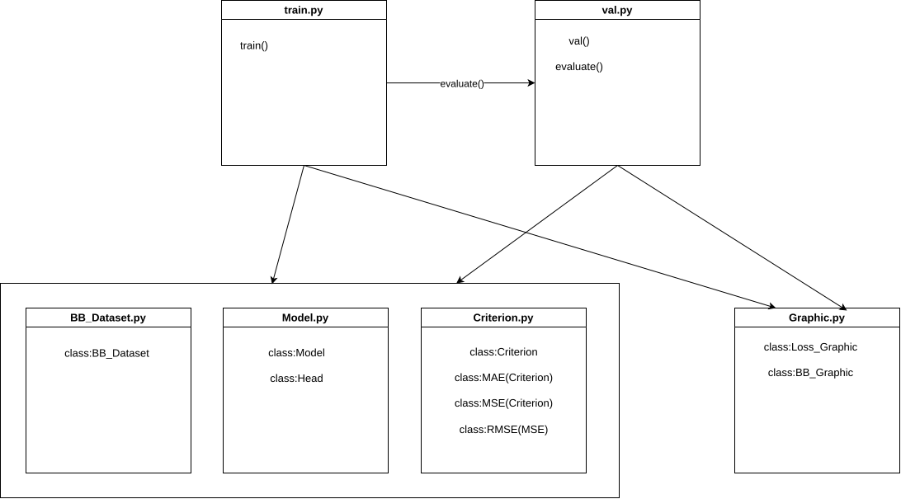
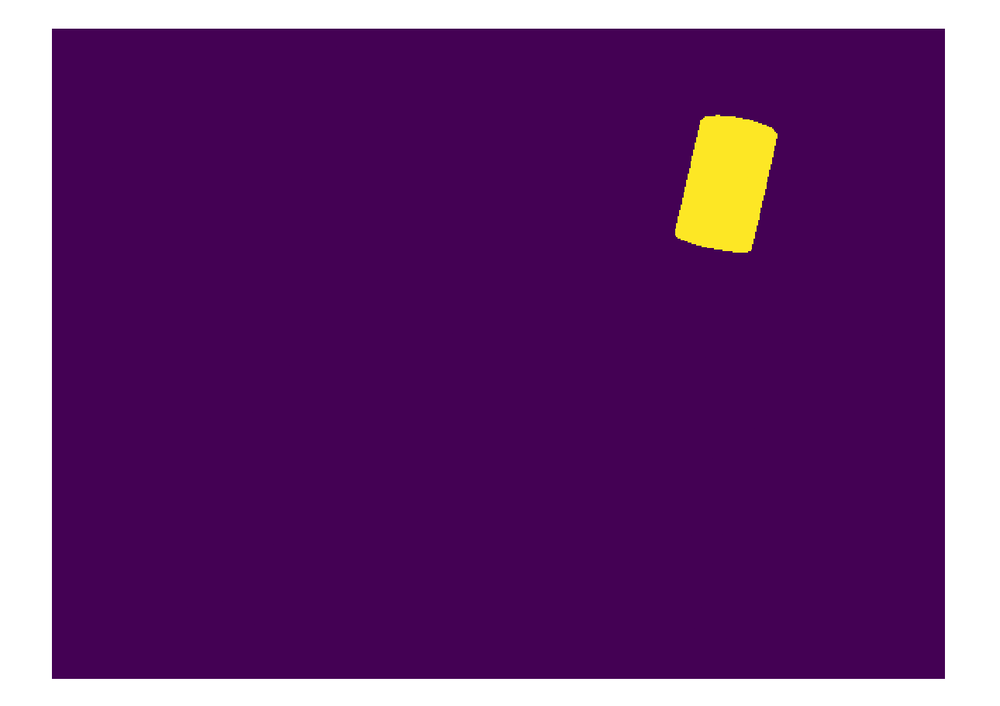
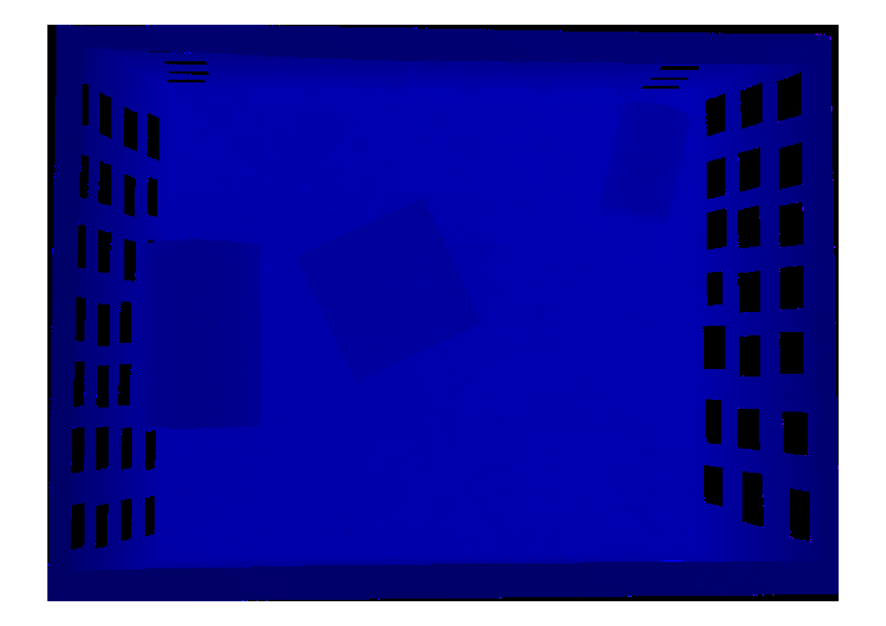
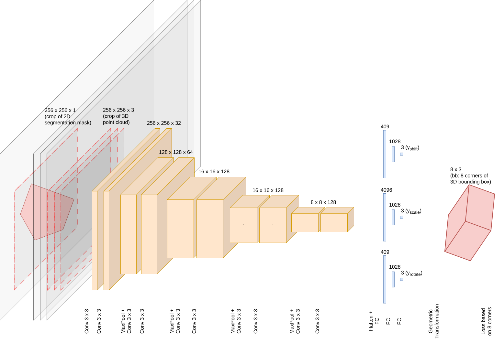
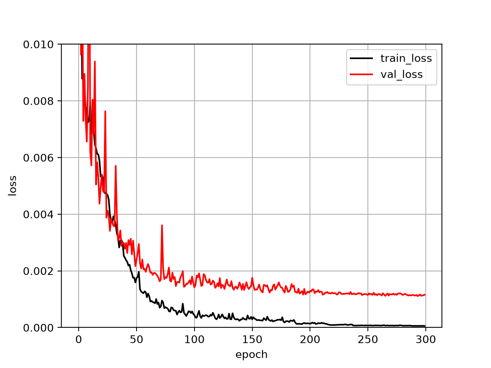
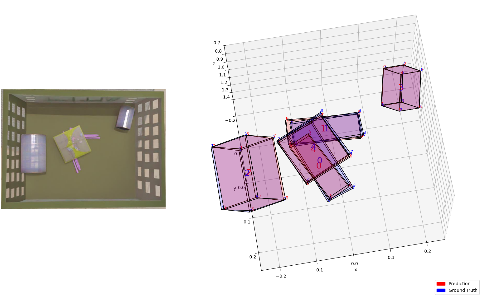
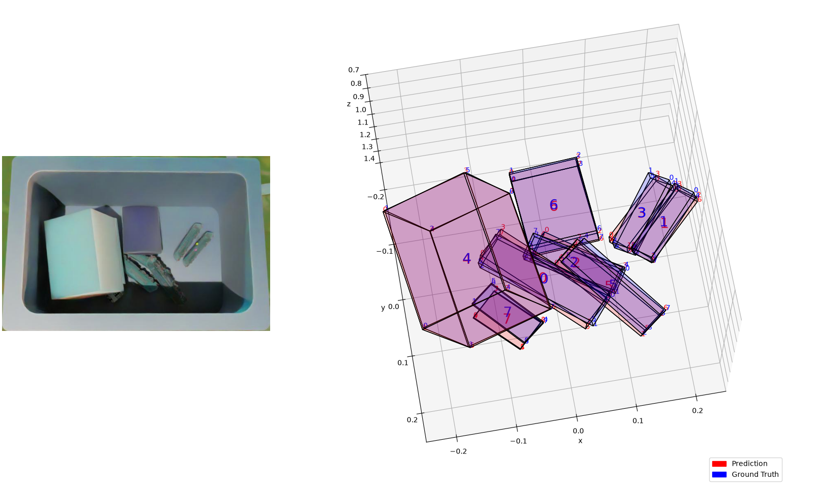
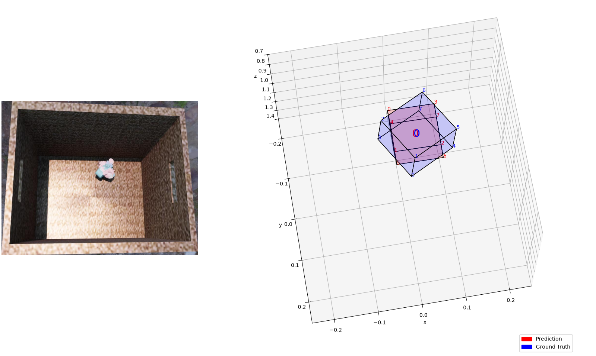
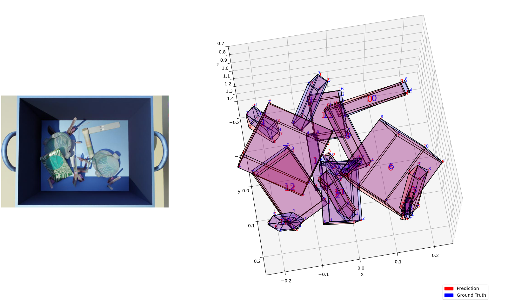

# 3D Bounding Boxes

2026-08-27 by David Nicklaser  

The project inferences 3D bounding boxes from a 3D point cloud and and 2D image segmentation mask.


## Setup

Clone the project. Navigate to the project directory and copy the dataset splits into the corresponding directories: *`./BB_Dataset_train`*, *`./BB_Dataset_val`*, and *`./BB_Dataset_test`*:
```bash
cd 3d-bboxes
```

Make sure you have *Python 3.12* installed and activated. You can check with:
```bash
python3 --version
```

Create a virtual environment, activate it and install the requirements:
```bash
python3 -m venv .venv && source .venv/bin/activate
pip install -r requirements.txt
```

To begin training, run *train.py*. Ensure that the *./BB_Dataset_train* and *./BB_Dataset_val* directory contains the necessary data samples, as they are not provided here.
```bash
python3 train.py
```

Run the *val.py* file to perform inference and visualization. Ensure that the *./BB_Dataset_test* directory contains the necessary data samples, as they are not provided here.
```bash
```bash
python3 val.py
```

To run the program on a remote GPU, scripts for remote execution are provided. During development, vast.ai instances with NVIDIA GPUs were used. Configure the server's IP address and port in config.sh, then initialize the server and start the program:
```bash
./server_init.sh
./server_run.sh
```

To adjust the training parameters, modify the *constants.py* file.


## Code Structure




## Methodology


### Dataset

The dataset consists of 200 crates, each containing multiple objects. Of these, 192 crates are used for training, 4 for validation, and 4 for testing. The final demo presents the model predictions on the 4 test crates. For each crate, the dataset contains a point cloud, segmentation masks, an RGB image, and the corresponding 3D bounding boxes as labels.

Inference is performed independently for each object, with one model inference per object mask and corresponding bounding box. This approach has two main advantages. First, predicting a single object is easier for the model. Second, the model is simpler, as it does not need to handle a variable number of objects.

However, there are also disadvantages. The total number of inference steps increases, which may lead to longer runtimes. Running a smaller model multiple times can be slower than using a larger model to predict all objects at once. On top of that, due to the fixed input size of 256 × 256, masks larger than the crop cannot be captured in their entirety. Furthermore, information outside the cropped region is discarded, including potentially relevant information from other instances of the same object in the scene.

Preprocessing extracts a 256 × 256 crop from both the mask and the point cloud, centered on the mask. If the object is near the image border, the center is shifted to still obtain a full 256×256 crop.
Augmentation is performed by independently shifting the crop in both image dimensions by a random offset between −10 and +10 pixels, sampled from a uniform distribution.
RGB values are not used. However, they may be worth exploring in the future, as they could provide additional information (e.g., shadows) that is not captured by the point cloud.


Each label has a shape of **8 × 3**:
- **8 × 3**: 8 corners of a bounding box

Each model input has a shape of **256 × 256 x 4** and is formed by concatenating the following inputs along the channel dimension:
- **256 × 256 x 1**: 1 channel for the mask (0.0 for background, 1.0 for object)
- **256 × 256 x 3**: 3 channels for the point cloud (x, y, z)

<p align="center">
  
  
</p>


### Model




#### Neural Network

The neural network architecture is based on VGG, with several modifications. It consists of 10 convolutional layers with $3 \times 3$ kernels and uses an input resolution of 256 × 256 instead of the original 224 × 224. The number of feature channels is also reduced to 32, 64, and 128, compared with 64, 128, 256, and 512 in VGG. This reduces the model capacity, which is beneficial given the limited amount of training data.

Residual blocks were also evaluated but performed worse than the standard convolutional layers in this setting.

For the final prediction, separate heads are used for $y_{shift}$, $y_{scale}$, and $y_{rotate}$. This multi-head architecture performed better than using a single shared prediction head.

#### Geometric Transformation

The neural network outputs  $y_{shift}$, $y_{scale}$, and $y_{rotate}$ are converted into the parameters of a 3D bounding box:

$$
\begin{aligned}
\text{center} &= y_{shift} \\
\text{size} &= \mathrm{softplus}(y_{scale}) \\
\text{angles} &= \tanh(y_{rotate}) \cdot \frac{\pi}{4}
\end{aligned}
$$

The eight bounding-box corners $bb$ are then obtained by scaling, rotating and shifting a unit cube $base$. The rotation matrix $R$ is constructed from the $angles$:


$$
bb = \left(\text{base} \odot \text{size}\right) R^T + \text{center}
$$

A rotation range of ±45° was chosen. Beyond 45°, the same orientation can be represented by swapping width and length, so larger angles are unnecessary. Rotation is currently represented using Euler angles for simplicity. Since the range is limited to ±45°, gimbal lock is not a concern. However, Euler angles can still be problematic due to their non-uniform representation. Alternative representations, such as quaternions, may perform better. Additionally, the use of the tanh function may cause issues, as values close to ±45° are harder for the model to reach.

When developing this project, I first started only with the center, then added the size and then the angles.


### Criterion

The loss is computed directly from the eight corners of the predicted and ground-truth bounding boxes. Since the corner ordering is not unique, all 24 rotationally equivalent permutations of the predicted box are considered. These correspond to the rotational symmetries of a cuboid: each of the 6 faces can point upwards, with 4 possible rotations for each face.

Here, $\mathbf{b}_i$ denotes a predicted bounding-box corner, $\mathbf{b}^{truth}_i$ the corresponding ground-truth corner, $\sigma$ a corner permutation, and $\mathcal{P}$ the set of all 24 valid permutations.

For each permutation, the error between corresponding corners is averaged over all eight corners, and the permutation with the smallest error is selected. For MSE, the squared Euclidean corner distance is used, while MAE uses the Euclidean distance directly.

For both criteria, the resulting losses are additionally averaged over all bounding boxes in the batch, which is omited from the equations for readability.

In the experiments, MSE performed better than MAE and was therefore chosen as the training criterion. RMSE is additionally used as an evaluation metric, allowing models trained with MSE and MAE to be compared using the same metric. RMSE is obtained by taking the square root of the final MSE after averaging over the batch.


$$
\mathcal{L}_{MSE}
= \min_{\sigma \in \mathcal{P}} \frac{1}{8} \sum_{i=0}^{7}
\left\| \mathbf{b}_{\sigma(i)} - \mathbf{b}^{truth}_i \right\|_2^2
$$


$$
\mathcal{L}_{MAE}
= \min_{\sigma \in \mathcal{P}} \frac{1}{8} \sum_{i=0}^{7}
\left\| \mathbf{b}_{\sigma(i)} - \mathbf{b}^{truth}_i \right\|_2
$$


$$
\mathcal{L}_{RMSE}=\sqrt{\mathcal{L}_{MSE}}
$$

The loss could also be computed directly using center, size, and rotation angles. However, this would require careful balancing of the different components. Another option is to compute the loss based on volume overlap. However, this approach is more complex and computationally expensive to implement.


## Training

Several architecture variations were tested but did not improve performance. These included increasing the first convolutional kernel from 3 × 3 to 5 × 5, replacing pooling with stride-2 convolutions, and using average pooling instead of max pooling. Residual blocks also performed worse than standard convolutional layers.

Different network depths and layer distributions were evaluated, with 10 convolutional layers performing best. Increasing the number of channel stages from three to four also showed no improvement.

For the prediction heads, separate heads for shift, scale, and rotation performed better than a single shared head. The number of fully connected layers and neurons per layer was also optimized.

Data augmentation improved performance and was used for the final model. Training was performed for 300 epochs with a batch size of 8, an initial learning rate of 0.0002, the Adam optimizer, and learning-rate scheduling based on validation performance.

<p align="center">
  
</p>


## Demo

<p>
  
</p>

<p>
  
</p>

<p>
  
</p>

<p>
  
</p>


## Credits

I completed this project independently. I also deliberately avoided researching existing approaches for 3D bounding box estimation to maximize my own learning. The loss function was developed entirely on my own and was not based on external sources or AI suggestions.
